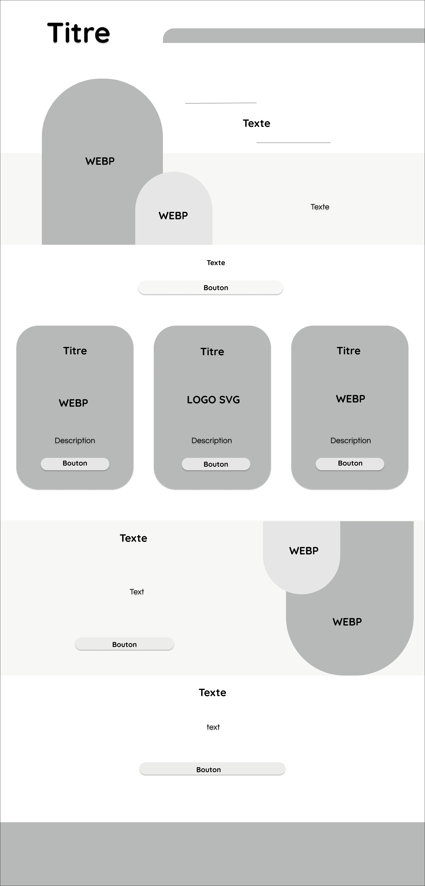

```mermaid
sequenceDiagram
  participant U as User
  participant FE as Game UI
  participant BE as Back-End (Flask API)
  participant DB as Database (MySQL)

  U->>FE: Play drag & drop game
  FE->>U: Show score + correct_items at end
  FE->>BE: POST /api/scores {points, correct_items, total_items, duration_ms}
  BE->>DB: INSERT INTO scores(...)
  BE->>DB: CALL sp_award_bouchons_by_items(user_id, score_id, correct_items)
  DB-->>BE: Update scores + wallet + transactions
  BE-->>FE: 200 OK {score_id, new_balance}
  FE-->>U: Display updated balance + “+X tokens” feedback

```

# 🦝 Stage 3 : Technical Documentation for Recy&Co!
---
## 👩‍🦰 Define User Stories and Mockup.

> **Purpose**: *To identify and prioritize the functionalities of the MVP from the user’s perspective and visualize its interface when applicable.*

### 1. <u>User story</u>:
| User story | Associated Page | Priority |
|---|---|---|
| As a user, I want to consult the local sorting guidelines so that I know in which bin to throw each waste. | Info-tri.html | Must Have |
| As a user, I want to search for an item with the “Where to throw?” bar so that I can quickly know in which bin to put it. | Ou-jeter.html | Must have |
| As a child/player, I want to play a drag & drop sorting game so that I can learn the rules in a fun way. | Jeu-de-tri.html | Must have |
| As a user, I want to create an account (username, email, password) so that I can save my scores and progress. | Auth.html | Must have |
| As a logged-in user, I want to see my username and my associated scores so that I can track my progress. | Index.html + jeu-de-tri.html | Must have |
| As a user, I want to easily navigate between the pages (Home, Info, Game, Where to throw?, Login, About) so that I can quickly access the features. | Base.html(header, menu, footer) | Must have |
| As a child/player, I want to receive visual feedback when I succeed/make a mistake so that I can improve. | Jeu-de-tri.html | Should have |
| As a user, I want to earn badges based on my scores so that I am motivated to progress. | Jeu-de-tri.html / auth.html | Could have |
| As a user, I want to earn virtual currency so that I can buy bonuses. | Shop.html | Could have |
| As a user, I want to customize my avatar or interface so that I can make my space unique. | (not planned) | Won’t have |
| As a foreign user, I want to change the language of the site so that I can understand the guidelines. | (not planned) | Won’t have |
| As a user, I want to access a real shop with goodies provided by the town hall so that I can buy physical items. | (not planned) | Won’t have |

### 2. <u>Mockups (wireframe)</u>:
.
.
.
.
.
---
## 📊 Design System Architecture.
> **Purpose**: *To define how the MVP components interact and ensure scalability and efficiency.*

---
## 📊 Define Components, Classes, and Database Design.
> **Purpose**: *To detail the internal structure of the system components.*

### 1. <u>Back-End – Key Classes and Services</u>
<b>Main Classes</b>

- <b>User</b>

	Attributes: `id`, `username`, `email`, `password_hash`, `created_at`, `last_login_at`.

	Methods: `verify_password(plain)`, `to_public_dict()`.

- <b>Score</b>

	Attributes: `id`, `user_id`, `points`, `correct_items`, `total_items`, `duration_ms`, `played_at`.

	Method: `efficiency() (calculates correct/total ratio)`.

- <b>Badge</b>

	Attributes: `id`, `code`, `label`, `description`, `threshold`.

- <b>ShopItem</b>

	Attributes: `id`, `sku`, `name`, `price, is_active`.

- <b>Wallet</b>

	Attributes: `user_id`, `balance`.

	(Managed via services and SQL procedures).

<b>Business Services</b>

- <b>AuthService</b>: registration, login, session management.

- <b>ScoreService</b>: adds a score and calls the SQL procedure to credit tokens.

- <b>BadgeService</b>: automatically assigns badges according to conditions.

- <b>WalletService</b>: read/credit/debit wallet balance.

- <b>ShopService</b>: lists items, handles purchase (debit + inventory update).

👉 This separation makes the code clearer, more maintainable, and consistent with eco-design (less duplication, centralized logic).

### 2. <u>Database – Relational Schema (MySQL)</u>
<b>Main Tables</b>

- <b>users</b> 
	`id`, `username*`, `email*`, `password_hash*`, `created_at`, `last_login_at?`

- <b>scores</b> 
	`id`, `user_id FK→users`, `points`, `correct_items*`, `total_items*`, `duration_ms`, `played_at`

- <b>users_wallet</b> 
	`user_id PK/FK→users`, `balance`

- <b>wallet_transactions</b> 
	`id`, `user_id FK`, `ttype [earn|spend|adjust]`, `amount>0`, `score_id?`, `item_id?`, `description?`, `created_at`

- <b>badges</b> 
	`id`, `code*`, `label*`, `description*`, `threshold?`

- <b>user_badges</b> 
	`user_id FK`, `badge_id FK`, `awarded_at`, `PK(user_id,badge_id)`

- <b>shop_items</b> 
	`id`, `sku*`, `name*`, `price*`, `is_active`

- <b>user_inventory</b> 
	`user_id FK`, `item_id FK`, `acquired_at`, `PK(user_id,item_id)`

*\* = mandatory fields · ? = optional fields*

<b>Token Business Rule</b>

1 correctly sorted item = 1 token.

At the end of a game, the server calls the procedure:
`sp_award_bouchons_by_items(user_id, score_id, correct_items)`

This procedure credits the wallet balance (`users_wallet.balance`) and adds a record in `wallet_transactions`.

### 3. <u>Front-End – Main UI Components and Interactions</u>
<b>Pages and Components</b>

- <b>Home</b>: introduction, quick navigation.

- <b>Sorting Info</b>: `RulesList` + `RuleCard` (reads `consignes.json` file).

- <b>Where to throw?</b>: `SearchBar` (client-side filtering) + `ResultsList`.

- <b>Game (drag & drop)</b>:

	- `DraggableItem` (waste item),

	- `DropZone` (bin),

	- `ScoreHUD` (score + tokens),

	- `EndModal` (summary + replay/continue buttons).

- <b>Authentication</b>: registration/login forms.

- <b>Shop</b>: `ItemGrid`, `BuyButton` (purchase only if balance sufficient).

- <b>About / Eco-design</b>: educational goals and eco-design principles.

<b>Main Interactions</b>

- <b>End of game</b>: the front-end sends a POST `/api/scores` with `{points, correct_items, total_items, duration_ms}`. 
	→ The server inserts the score and credits `correct_items` tokens. 
	→ The response includes the updated balance, displayed in the header and `EndModal`.

- <b>Shop</b>: click “Buy” → POST `/api/shop/purchase` → debit wallet balance + update inventory.

- <b>Header</b>: continuously displays the player’s balance “X”.

👉 Eco-design: local JSON for sorting rules, no heavy framework (vanilla JS), SVG/WebP images, minified CSS/JS.

---
## 📊​ Create High-Level Sequence Diagrams.
> **Purpose**: *To show how components or services interact for key use cases.*

I identified three critical use cases:

1. <b>User Login</b> (authentication flow).

 
2. <b>Play a Sorting Game</b> (record score, award tokens).

 
3. <b>Purchase an Item in the Shop</b> (debit tokens, update inventory).

 
The following sequence diagrams illustrate how the <b>Front-End, Back-End, and Database components</b> interact for each case:

- <b>Login</b>: The front-end collects credentials, the back-end verifies them against the database, and returns a session/JWT token if valid.

- <b>Game</b>: At the end of a session, the score and correct items are sent to the back-end, which inserts the score and awards tokens via an SQL procedure.

- <b>Shop</b>: A purchase request triggers a stored procedure that debits the wallet, inserts a transaction, and adds the item to the user inventory.

👉 These diagrams demonstrate the key system interactions, focusing on simplicity, database integrity, and eco-design principles (minimal calls, compact data).

---
## 📚​ Document External and Internal APIs.
> **Purpose**: *To specify how the system interacts with external APIs and define its own API.*

1. <b>External APIs</b>

No external API is required for the MVP.

| External API | Purpose | Priority |
|---|---|---|
| ipapi.co | Detect the user’s city automatically | Won’t Have (Optional, not part of MVP) |

2. <b>Internal Project API</b>

Récy&Co exposes a lightweight <b>REST API</b> for front-end interactions. All input and output use <b>JSON</b>. Authentication endpoints return a <b>session cookie or JWT</b>.

<b><u>Authentification</u></b>

| URL Path | Method | Input JSON | Output JSON |
|---|---|---|---|
| /api/register | POST | { "username": "...", "email": "...", "password": "..." } | { "user_id": 1, "username": "sam" } |
| /api/login | POST | { "email": "...", "password": "..." } | { "token": "...", "user": { "id":1, "username":"sam", "balance":0 } } |
| /api/me | GET | (session/JWT) | { "id":1, "username":"sam", "balance":12 } |
| /api/logout | POST | - | { "success": true } |

<b><u>Scores & Tokens</u></b>

| URL Path | Method | Input JSON | Output JSON |
|---|---|---|---|
| /api/scores | POST | { "points": 500, "correct_items": 14, "total_items": 20, "duration_ms": 72000 } | { "score_id":123, "balance": 25 } |
| /api/scores/me | GET | (auth required) | [ { "id":123, "points":500, "correct_items":14, "played_at":"..." }, ... ] |
| /api/leaderboard | GET | Optional query ?limit=10 | [ { "username":"sam", "points":500 }, ... ] |

<b><u>Badges</u></b>

| URL Path | Method | Input | Output JSON |
|---|---|---|---|
| /api/badges/me | GET | - | [ { "code":"FIRST_GAME", "label":"First Game", "awarded_at":"..." }, ... ] |

<b><u>Wallet & Shop</u></b>

| URL Path | Method | Input JSON | Output JSON |
|---|---|---|---|
| /api/wallet | GET | - | { "balance": 25, "transactions":[...] } |
| /api/shop/items | GET | - | [ { "id":1, "name":"Hat", "price":10, "is_active":true }, ... ] |
| /api/shop/purchase | POST | { "item_id": 1 } | { "success":true, "new_balance":15, "item":{ "id":1, "name":"Hat" } } |

<b><u>Recycling Info (local JSON)</u></b>

| URL Path | Method | Input | Output JSON |
|---|---|---|---|
| /api/rules | GET | - | Returns the content of consignes.json (e.g., [ { "waste":"paper", "bin":"blue" }, ... ]) |

👉 The API design follows eco-design principles: JSON only, minimal payloads, no unnecessary endpoints, caching static data.

---
## 📋 Plan SCM and QA Strategies.
> **Purpose**: *To establish procedures for managing code, the development lifecycle, and ensuring quality.*

### <b>SCM and QA Strategy – Récy&Co</b>

<b>1. SCM Strategy (Version Control)</b>

- <b>Version Control Tool</b>: Git with GitHub for remote repository hosting.

- <b>Commit Convention</b>: Gitmoji is used to make commit messages clear and visually structured (e.g., ✨ feat: add drag & drop game, 🐛 fix: score calculation).

- <b>Branching Model</b>:

  - `main` → stable production branch (never coded on directly).

  - `samira` → main development branch where features are implemented.

  - `test` → staging branch used for testing before merging into main.

- <b>Workflow</b>:

  - New features are committed to the development branch.

  - Code is tested locally and, if necessary, merged into the staging branch (test).

  - Once validated, changes are merged into main for production deployment.

- <b>Good Practices</b>:

  - Frequent, small commits with descriptive messages.

  - Pull requests (even when working alone) to encourage code review and self-validation before merging.

  👉 This strategy ensures code clarity, keeps production stable, and maintains a professional workflow without unnecessary complexity.

### <b>2. QA Strategy (Quality Assurance)</b>

<b>Testing Levels</b>

- <b>Unit Tests (automated)</b>:

  - Implemented with Pytest in Python.

  - Example: test that ScoreService.add_score() correctly increments tokens in the wallet.

- <b>Integration Tests (API)</b>:

  - Performed with Postman.

  - Example: POST `/api/scores` should create a new score record and update the wallet balance.

- <b>Manual Tests (critical user flows)</b>: 
  Manual checks of essential scenarios from an end-user perspective:

  - User registration → new account appears in the database.

  - Login → username and wallet balance are displayed.

  - Play a game → score saved and tokens awarded.

  - Purchase in the shop → balance decreases and item is added to the inventory.

<b>Deployment Pipeline</b>

- <b>Staging</b>: local development environment where unit and integration tests are executed.

- <b>Production</b>: stable main branch is deployed to a lightweight hosting service (e.g., PythonAnywhere, Render, or Railway).

- <b>Process</b>:

  - Develop and test on the `samira` branch.

  - Validate changes in the `test` branch.

  - Merge into `main` for deployment.

👉 This simple pipeline ensures a clear separation between development, testing, and production, while keeping the project lightweight and eco-friendly.

---
## 📃​ Technical Justifications

Python + Flask → simple, lightweight, and well-suited for an eco-designed project.

MySQL → robust relational database, lightweight, and easy to host.

Front-end (HTML, CSS, Vanilla JS) → minimalistic approach without heavy frameworks, aligned with eco-design principles.

Local JSON for sorting rules → static, cacheable, and ultra-lightweight.

Eco-design choices → optimized SVG/WebP images, minified CSS/JS, and no unnecessary external APIs.

---
## 🎯 Authors

- 👨‍💻 : **Roche Samira** – [GitHub](https://github.com/StrawberSam)
