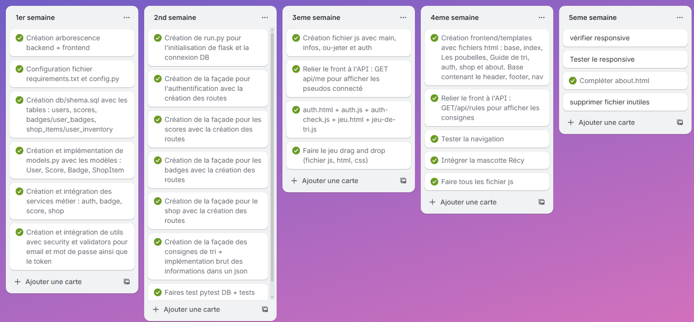

# Stage 4: MVP Development and Execution - Récy&Co
**Author**: Samira Roche
**Project**: Récy&Co - Educational web application for waste sorting
**Period**: September 29 - October 28, 2025
**Training**: RNCP5 - Web and Mobile Web Developer - Holberton School Laval

## 1. Introduction

Récy&Co is an educational web application designed to raise awareness among children and families about selective sorting. The project takes the form of an interactive website including local sorting guidelines, a "Sorting Guide" search engine, and a drag & drop sorting game with the mascot Récy the raccoon.

The objective of Stage 4 is to transform the technical documentation (Stage 3) into a functional MVP (Minimum Viable Product), adopting an Agile approach based on weekly sprints.

The development was organized into 5 one-week sprints, covering the period from September 29 to October 28, 2025. The work was divided between back-end (weeks 1-2), front-end (weeks 3-4), and finishing touches (week 5).

## 2. Sprint Planning

### Sprint Overview

| Sprint | Period | Main Objective | Duration |
|--------|---------|-------------------|-------|
| Sprint 1 | 09/29 - 10/05 | Back-End: Database + Services | 1 week |
| Sprint 2 | 10/06 - 10/12 | Back-End: Flask API + Tests | 1 week |
| Sprint 3 | 10/13 - 10/19 | Front-End: Structure + Authentication | 1 week |
| Sprint 4 | 10/20 - 10/26 | Front-End: Game + Gamification | 1 week |
| Sprint 5 | 10/27 - 10/28 | Finishing Touches + Responsive | 1 week |

### Sprint 1: Back-End - Database + Services
**Period**: 09/29/25 - 10/05/25
**Objective**: Have the MySQL database and Python services ready

**Tasks with MoSCoW priorities**:

**Must Have** (essential for MVP):
- Create backend architecture (backend/, db/, services/, utils/)
- Configure requirements.txt (Flask, SQLAlchemy, bcrypt, PyJWT)
- Create db/schema.sql with users and scores tables
- Implement db/models.py: User and Score classes
- Create auth_service.py (registration, login)
- Create score_service.py (add score, total points)
- Create utils/security.py (password hashing + JWT)

**Should Have** (important but not critical):
- Create badges / user_badges tables
- Create badge_service.py (automatic attribution)
- Create db/seeds.sql with test data

**Could Have** (bonus if time available):
- Create shop_items / user_inventory tables
- Create shop_service.py (shop management)

**Identified dependencies**:
- Models must be created before services
- Database tables must exist before implementing models
- Authentication system must be functional before other services

### Sprint 2: Back-End - Flask API + Tests
**Period**: 10/06/25 - 10/12/25
**Objective**: Have a complete and tested REST API to connect front-end to back-end

**Tasks with MoSCoW priorities**:

**Must Have** (essential for MVP):
- Create run.py (Flask initialization + DB connection)
- Implement authentication routes: POST /api/register, POST /api/login, GET /api/me, POST /api/logout
- Implement scores routes (game): POST /api/scores, GET /api/scores/me, GET /api/leaderboard
- Test all routes with Postman
- Write Pytest tests to validate critical functionalities (auth, scores)

**Should Have** (important but not critical):
- Implement badges routes: GET /api/badges, GET /api/badges/me
- Implement shop routes: GET /api/shop/items, POST /api/shop/purchase
- Pytest tests for badges and shop

**Could Have** (bonus if time available):
- Sorting guidelines route: GET /api/rules (accessible without authentication)
- API documentation with Swagger/OpenAPI

**Identified dependencies**:
- Business services from Sprint 1 must be completed before creating API routes
- Routes must be created before they can be tested
- Authentication must work before testing protected routes (scores, badges, shop)
- Pytest tests help identify and fix bugs before moving to front-end

### Sprint 3: Front-End - Structure + Authentication
**Period**: 10/13/25 - 10/19/25
**Objective**: Create HTML/CSS skeleton and connect authentication system to API

**Tasks with MoSCoW priorities**:

**Must Have** (essential for MVP):
- Create base.html (header, footer, nav) for reusability with Jinja2
- Create auth.html + auth.js (registration/login forms connected to API)
- Create jeu.html (basic structure, flagship page of the site)
- Create index.html (home page)
- Create frontend/static/css/style.css (basic responsive layout)
- Connect front ↔ API: GET /api/me to display connected username
- Create main.js (navigation, dynamic header with username + score)

**Should Have** (important but not critical):
- Create infos.html (sorting guidelines page)
- Create guide-de-tri.html (search bar)
- Advanced responsive CSS for all pages
- Visual optimization (icons, bins) to detect display bugs

**Could Have** (bonus if time available):
- Create shop.html (structure)
- Create about.html (structure)
- Basic CSS animations

**Identified dependencies**:
- base.html must be created first as all other pages inherit from it
- Authentication system (auth.html + auth.js) must be functional before game, as users must have an account to play
- Back-end API from Sprint 2 must be operational to test front ↔ back connection
- Basic CSS allows visualizing drag & drop and identifying bugs via browser console
- jeu.html must have a minimum presentable rendering as it's the central page of the project

### Sprint 4: Front-End - Game + Gamification
**Period**: 10/20/25 - 10/26/25
**Objective**: Integrate drag & drop game interface and gamification features

**Tasks with MoSCoW priorities**:

**Must Have** (essential for MVP):
- Create complete game interface (jeu.html)
- Implement native drag & drop (JavaScript)
- Real-time score calculation and dynamic display
- Send score to API at end of game: POST /api/scores
- Display user's updated total score after game
- Dynamic header: display updated total score

**Should Have** (important but not critical):
- Integrate Reci mascot (lightweight SVG/WebP)
- Retrieve badges via GET /api/badges/me
- Display unlocked badges on profile page

**Could Have** (bonus if time available):
- Mascot animations (reactions to success/errors)
- Display shop items via GET /api/shop/items
- Implement purchase via POST /api/shop/purchase

**Identified dependencies**:
- Authentication system from Sprint 3 must be functional to identify user
- Scores API from Sprint 2 must be operational to save results
- Game must be **functional before** integrating decorative elements (mascot)
- User experience (drag & drop + real-time score) is priority for concept validation

### Sprint 5: Finishing Touches + Responsive
**Period**: 10/27/25 - 10/31/25 (extended to 1 full week)
**Objective**: Finalize missing pages, ensure responsive and legal compliance

**Tasks with MoSCoW priorities**:

**Must Have** (essential for delivery and defense):
- Complete about.html with legal notices and GDPR (legal obligation for deployment)
- Responsive design for all pages (defense requirement + majority mobile/tablet usage)
- Verify basic accessibility (contrast, alt text on images)
- Optimize images (WebP format, compression)

**Should Have** (important but not critical):
- Finalize infos.html (complete sorting guidelines)
- Finalize guide-de-tri.html (functional search)
- CSS/JS minification for performance
- Final tests on different browsers

**Could Have** (bonus if time available):
- Advanced CSS animations
- Functional shop.html page
- PWA mode (offline, manifest.json)

**Won't Have** (excluded from this sprint):
- Production deployment (planned after defense)

**Identified dependencies**:
- Responsive is **Must Have** as required for defense and corresponds to actual usage (mobile/tablet)
- Legal notices are **mandatory** before any public deployment (GDPR compliance)
- All main functionalities must be finalized before optimization

**Important note**:
Sprint 5 was extended from 2 days to 1 full week (until 10/31) to adapt planning to project reality. This flexibility conforms to Agile methodology which encourages adjustment based on actual needs. Responsive design is not yet completely finished at the time of writing this document (10/28), but remains in progress for finalization before defense.

---
## 3. Sprint Execution (Task 1)

### Sprint 1: Back-End - Database + Services
**Period**: 09/29/25 - 10/05/25

**Achievements**:
- ✅ Creation of backend architecture (backend/, db/, services/, utils/)
- ✅ Configuration of requirements.txt with Flask, SQLAlchemy, bcrypt, PyJWT
- ✅ Configuration of config.py (DB_URL, SECRET_KEY, JWT settings)
- ✅ Creation of db/schema.sql with tables: users, scores, badges, user_badges, shop_items, user_inventory
- ✅ Creation of db/seeds.sql with test data
- ✅ Implementation of db/models.py: User, Score, Badge, ShopItem classes
- ✅ Creation of business services:
  - auth_service.py (registration, login, JWT)
  - score_service.py (add score, calculate total)
  - badge_service.py (automatic attribution)
  - shop_service.py (shop management, inventory)
- ✅ Creation of utils/security.py (bcrypt hashing + JWT)

**Evidence**:
- Private GitHub repository (access provided on request)
- Complete file structure visible in repository
- Validation tests performed

### Sprint 2: Back-End - Flask API + Tests
**Period**: 10/06/25 - 10/12/25

**Achievements**:
- ✅ Creation of run.py (Flask initialization + DB connection)
- ✅ Implementation of authentication routes:
  - POST /api/register
  - POST /api/login
  - GET /api/me
  - POST /api/logout
  - POST /api/refresh
- ✅ Implementation of scores routes:
  - POST /api/scores
  - GET /api/scores/me
  - GET /api/leaderboard
- ✅ Implementation of badges routes:
  - GET /api/badges
  - GET /api/badges/me
- ✅ Implementation of shop routes:
  - GET /api/shop/items
  - POST /api/shop/purchase
  - POST /api/shop/can_purchase
- ✅ Implementation of guidelines route: GET /api/rules
- ✅ Postman tests for all routes
- ✅ Pytest tests: 17 tests passed covering auth, scores, badges, shop

**Evidence**:
- Private GitHub repository (access provided on request)
- Pytest screenshot: 17/17 tests passed (see below)

### Sprint 3: Front-End - Structure + Authentication
**Period**: 10/13/25 - 10/19/25

**Achievements**:
- ✅ Creation of frontend/templates/:
  - base.html (header, footer, nav with Jinja2)
  - index.html (home page)
  - auth.html (registration/login)
  - jeu.html (basic structure)
- ✅ Creation of frontend/static/css/style.css (responsive layout)
- ✅ Creation of frontend/static/js/:
  - main.js (navigation, dynamic header with username + score)
  - auth.js (registration/login forms connected to API)
  - auth-check.js (user session verification)
  - auth_refresh.js (refresh token)
  - infos.js (display consignes.json)
  - guide-tri.js (guidelines search bar)
- ✅ Front ↔ API connection: GET /api/me to display connected username
- ✅ Session management with JWT (access_token + refresh_token)

**Evidence**:
- Private GitHub repository (SWE has access - will be public before defense)
- Functional pages with complete authentication

### Sprint 4: Front-End - Game + Gamification
**Period**: 10/20/25 - 10/26/25

**Achievements**:
- ✅ Complete game interface (jeu.html finalized)
- ✅ Native drag & drop implementation in JavaScript
- ✅ Real-time score calculation and dynamic display
- ✅ Score sent to API: POST /api/scores
- ✅ Updated total score display after game
- ✅ Reci mascot integration (SVG/WebP)
- ✅ Complete home page creation (hero section, features, shop)
- ✅ Image optimization (WebP conversion with GIMP)
- ✅ User profile page creation with dynamic data display
- ✅ JWT tokens management via HTTP-only cookies (enhanced security)

**Evidence**:
- Private GitHub repository (SWE has access - will be public before defense)
- Functional game with persistent score system

### Sprint 5: Finishing Touches + Responsive
**Period**: 10/27/25 - 10/31/25

**Achievements**:
- ✅ Creation of "Sorting Guide" page with functional search
- ✅ Enrichment of consignes.json file with extended keywords
- ✅ Creation of About page with:
  - Legal notices
  - GDPR and legal compliance
  - Eco-design approach
- ✅ CSS improvement of all pages
- ✅ Image optimization (WebP format, compression)
- ⏳ Responsive design in progress for finalization (priority before defense)

**Evidence**:
- Private GitHub repository (SWE has access - will be public before defense)
- About and Sorting Guide pages functional
- GDPR compliance documented

**Note**: Responsive design is being finalized this week (10/28-31) to be ready for defense. This sprint extension reflects Agile adaptation to actual project constraints.

---

## 4. Progress Monitoring (Task 2)

### Progress tracking with Trello

The project was tracked using a Trello Kanban organized into 5 columns corresponding to the 5 sprints. Each task was moved as it was completed.

### Velocity per sprint

| Sprint | Planned tasks | Completed tasks | Completion rate |
|--------|-------------------|-------------------|---------------------|
| Sprint 1 | 6 | 6 | 100% |
| Sprint 2 | 7 | 7 | 100% |
| Sprint 3 | 4 | 4 | 100% |
| Sprint 4 | 5 | 5 | 100% |
| Sprint 5 | 4 | 1 (in progress) | ~10% (finalization in progress) |

### Adjustments made

**Sprint 5 Extension**: The final sprint was extended from 2 days to 1 full week (10/27 → 10/31) to finalize responsive design and ensure legal compliance (legal notices, GDPR). This flexibility demonstrates concrete application of Agile principles: adaptation to actual project needs rather than rigid adherence to initial planning.

**Dynamic prioritization**: Some "Could Have" features (complete shop, advanced animations) were postponed to guarantee quality of "Must Have" features before defense.

---

## 5. Sprint Reviews & Retrospectives (Task 3)

### Retrospective Sprint 1: Back-End - Database + Services

#### ✅ What worked well
- Clear and well-organized project structure from the start
- Configuration of tools (Flask, SQLAlchemy, JWT, Bcrypt) without major problems
- Rapid creation of database schema with all necessary tables
- Smooth implementation of SQLAlchemy models
- Business services well separated according to their responsibilities

#### ❌ Difficulties encountered
- **Problem 1**: Type error for user ID (`CHAR` instead of `INTEGER AUTO_INCREMENT`)
- **Problem 2**: Incorrect access to configuration variables (attempt to use `config.KEY` instead of `config["KEY"]`)
- **Problem 3**: Circular import between modules
- **Problem 4**: Complex initial Flask migration

#### 🔧 Solutions applied
- Correction of SQL schema to use `INTEGER AUTO_INCREMENT` on ID
- Modification of all config access to dictionary notation: `config["SECRET_KEY"]`
- Reorganization of imports to avoid circular dependencies
- Addition of `get_all_users()` function with restricted access control

#### 💡 Learnings
- Importance of correct data type definition in SQL from the start
- Understanding differences between attribute and dictionary access in Python
- Mastery of service architecture to separate business logic
- Learning import patterns to avoid circular dependencies

---

### Retrospective Sprint 2: Back-End - Flask API + Tests

#### ✅ What worked well
- Rapid creation of API routes based on existing services
- Standardized response structure `{success: true/false, data/message}`
- Postman tests allowing validation of each endpoint progressively
- Complete Pytest test coverage (17/17 tests passed)

#### ❌ Difficulties encountered
- **Problem 1**: Missing `__init__.py` file in `app/tests/` causing import errors
- **Problem 2**: Name conflict between `app.py` and `app/` folder
- **Problem 3**: Missing configuration: `JWT_REFRESH_EXP_MINUTES` not defined
- **Problem 4**: Assertion structure in tests not matching response format
- **Problem 5**: Incorrect token extraction in tests (`data.get("token")` instead of `data["data"]["access_token"]`)
- **Problem 6**: Use of `Badge.user_id` instead of `UserBadge` relationship
- **Problem 7**: Security: extraction of `user_id` from JWT token not implemented in POST /api/scores

#### 🔧 Solutions applied
- Addition of `__init__.py` file in tests folder
- Renaming of `app.py` to `run.py` to avoid confusion
- Addition of `JWT_REFRESH_EXP_MINUTES` in `config.py`
- Correction of assertions to match `{"data": {...}, "success": True}`
- Correction of token extraction: `data["data"]["access_token"]`
- Correct use of `UserBadge` for many-to-many relationship
- Implementation of `user_id` extraction from JWT in scores route

#### 💡 Learnings
- Importance of Python folder structure (packages vs modules)
- Understanding API response standardization
- Mastery of unit and integration tests with Pytest
- Learning JWT security: token extraction and validation
- Understanding many-to-many relationships in SQLAlchemy

---

### Retrospective Sprint 3: Front-End - Structure + Authentication

#### ✅ What worked well
- Rapid HTML/CSS structure creation thanks to Jinja2 templates
- Smooth authentication system integration with API
- Modular CSS organization (base.css separated from specific CSS)
- Effective Flask routing system implementation
- Jinja blocks system for loading specific CSS/JS per page

#### ❌ Difficulties encountered
- **Problem 1**: Incompatibility between sending and reading token method (cookies vs headers)
- **Problem 2**: Refreshed token not recognized by Flask (returned in JSON instead of cookie)
- **Problem 3**: Response structure with "data" wrapper not correctly extracted on JavaScript side
- **Problem 4**: Incorrect path for templates (`templates/index.html` not found)
- **Problem 5**: Insufficient connection verification (existing cookie but expired token)

#### 🔧 Solutions applied
- Modification of /api/me route to read token from cookies first
- Addition of `response.set_cookie()` in /api/refresh route to create HTTP-only cookie
- Correction of `getUserData()` function in JavaScript to extract `json.data`
- Addition of `"../"` before frontend in Flask routing paths
- Creation of `auth-check.js` with server verification via `/api/me` instead of simple local verification

#### 💡 Learnings
- Deep understanding of difference between access_token and refresh_token
- Mastery of HTTP-only cookies management for security
- Learning API response structure with wrappers
- Importance of consistency between front-end and back-end in token management
- Understanding Jinja2 template architecture

---

### Retrospective Sprint 4: Front-End - Game + Gamification

#### ✅ What worked well
- Rapid and smooth native drag & drop implementation
- Real-time score calculation without major bugs
- Successful Reci mascot integration
- Complete migration to JWT HTTP-only cookies (enhanced security)
- Effective profile page creation with dynamic display
- Image optimization with GIMP (WebP conversion)

#### ❌ Difficulties encountered
- **Problem 1**: JavaScript typo (`toLocalDateString` instead of `toLocaleDateString`)
- **Problem 2**: Total score not displayed (`total_score` field missing in service response)
- **Problem 3**: Initial confusion on `duration_ms` calculation (theoretical vs actual time)
- **Problem 4**: `add_score()` function didn't create record in scores table
- **Problem 5**: Non-uniform token reading across different facades

#### 🔧 Solutions applied
- Correction of typo: `toLocaleDateString` (with "e")
- Addition of `"total_score": user.total_score` in `auth_service.get_user_by_id()`
- Implementation of actual duration calculation with game start/end timestamps
- Correction of `add_score()` to create and save Score object in database
- Uniform migration of all facades (auth, score, badge, shop) to reading from cookies

#### 💡 Learnings
- Importance of consistency in JavaScript method names
- Understanding data persistence (saved scores vs in-memory calculations)
- Mastery of HTTP-only cookies system across entire application
- Learning time management in JavaScript (timestamps, duration)
- Consolidation of front-end ↔ back-end architecture

---

### Retrospective Sprint 5: Finishing Touches + Responsive

#### ✅ What worked well
- Rapid and effective creation of "Sorting Guide" page with functional search
- Easy JSON enrichment thanks to existing structure
- Smooth writing of About page with legal notices and GDPR
- Progressive CSS improvement on all pages
- Continuous image optimization

#### ❌ Difficulties encountered
- **Problem 1**: Initial time shortage (sprint planned for only 2 days)
- **Problem 2**: Responsive design more time-consuming than expected
- **Problem 3**: Need to document GDPR compliance comprehensively

#### 🔧 Solutions applied
- Sprint extension from 2 days to 1 full week (Agile flexibility)
- Strict prioritization of Must Have (legal notices, responsive) before Could Have
- Structured documentation of GDPR compliance on About page

#### 💡 Learnings
- Importance of realistic time estimation for responsive
- Understanding legal obligations (legal notices, GDPR) for production site
- Mastery of Agile adaptation: adjust planning according to actual needs
- Awareness of mobile-first importance in current context

---

## 6. Final Integration & QA Testing (Task 4)

### End-to-End Integration Tests

Integration tests were performed to verify complete application functionality on real user scenarios:

**Scenario 1: Complete user journey - Registration → Game → Score**
1. ✅ New user registration via POST /api/register
2. ✅ Login with credentials via POST /api/login
3. ✅ Display of username and initial score (0) in header
4. ✅ Functional drag & drop sorting game
5. ✅ Real-time score calculation during game
6. ✅ Score saved in database via POST /api/scores
7. ✅ Updated total score displayed in header
8. ✅ Persistent score after logout/login

**Scenario 2: Session management and security**
1. ✅ JWT token stored in HTTP-only cookie
2. ✅ Automatic refresh of expired token
3. ✅ Redirect to /auth if invalid session
4. ✅ Route protection (game, profile) against unauthenticated access

**Scenario 3: Sorting guidelines consultation**
1. ✅ Display of guidelines by bin on /infos
2. ✅ Functional search on /guide-de-tri
3. ✅ Correct loading of consignes.json file
4. ✅ Display of waste icons and descriptions

### Unit Tests (Pytest)

**Back-end test results:**
- **17 tests passed** covering:
  - Authentication (registration, login, session verification, refresh token)
  - Scores (add, retrieve, leaderboard, efficiency calculation)
  - Badges (retrieval, automatic attribution)
  - Shop (list items, purchase)

[Pytest Tests - 17/17 passed](picture/pytest-services.png "img test for pytest").

**Regression tests identified and fixed:**

During development, several bugs were detected via tests then fixed:

- ❌ `test_add_score`: Score not saved in database → ✅ Fixed
- ❌ `test_purchase_item`: Incorrect score deduction → ✅ Fixed
- ❌ `test_cleanup_database`: Test database cleanup → ✅ Fixed

### Manual Tests (Postman)

All API routes were manually tested with Postman:
- ✅ POST /api/register
- ✅ POST /api/login
- ✅ GET /api/me
- ✅ POST /api/refresh
- ✅ POST /api/scores
- ✅ GET /api/scores/me
- ✅ GET /api/leaderboard
- ✅ GET /api/badges
- ✅ GET /api/badges/me
- ✅ GET /api/shop/items
- ✅ POST /api/shop/purchase
- ✅ GET /api/rules

### Browser Tests

**Browsers tested:**
- ✅ Google Chrome (version 118+)
- ⏳ Firefox (version 119+)
- ⏳ Safari (tests planned)

**Responsive tested on:**
- ✅ Desktop (1920x1080, 1366x768)
- ⏳ Tablet (finalization in progress)
- ⏳ Mobile (finalization in progress)

### Critical bugs fixed

| Bug | Impact | Solution | Status |
|-----|--------|----------|--------|
| Token in JSON instead of cookie | Compromised security | Migration to HTTP-only cookies | ✅ Fixed |
| Non-persistent score | Lost progression | Database recording via API | ✅ Fixed |
| Insufficient session verification | Unauthorized access | Server verification via /api/me | ✅ Fixed |
| Inconsistent API response structure | Front-end bugs | Standardization {success, data} | ✅ Fixed |
| Incomplete responsive | Degraded mobile UX | Finalization in progress (Sprint 5) | ⏳ In progress |

### Performance and eco-design

**Optimizations performed:**
- ✅ Images converted to WebP (~60% size reduction)
- ✅ Sorting guidelines in local JSON (no heavy API call)
- ✅ Modular CSS (only necessary loading per page)
- ⏳ CSS/JS minification planned before deployment

**Loading times:**
- Home page: ~1.2s
- Game page: ~1.5s
- Guidelines search: instant (local JSON)

**Features planned for version 2.0 (post-MVP):**
- ⏳ Leaderboard (dedicated page) - Backend API already exists (GET /api/leaderboard), only user interface remains to implement
- ⏳ Complete shop system with bonus purchases
- ⏳ Advanced Reci mascot animations
- ⏳ Addition of bin and recycling center locations in Sorting Guide

## Architectural Decisions

### Removal of admin endpoint `/api/users`
**Date:** October 30, 2025
**Decision:** Removal of user administration functionality

**Context:**
A `/api/users` route with admin authentication had been created to retrieve
the list of all users.

**Reasons for removal:**
1. No use case in MVP user stories
2. No planned administration interface
3. Potential performance issue (retrieving all users)
4. YAGNI principle (You Aren't Gonna Need It)
5. Reduction of security attack surface

**Alternative:**
The leaderboard (`GET /api/leaderboard`) already allows viewing top players.
If an admin panel is needed in the future, it will be designed according to actual needs.

**Deleted code:**
- Route `GET /api/users`
- Method `AuthService.get_all_users()`
- Configuration `ADMIN_ID`
